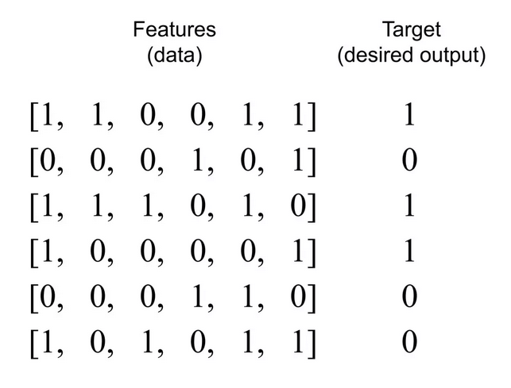
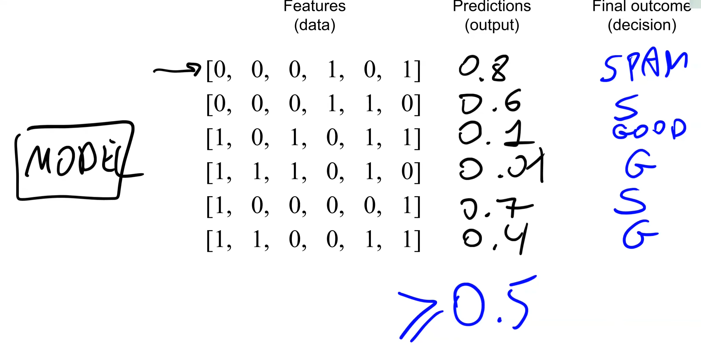
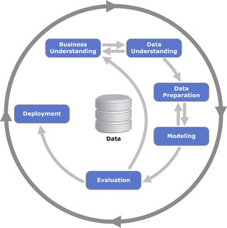

# Introduction to Machine Learning

## Introduction to Machine Learning

DATA -> ML -> PATTERNS

e.g. Determine price for used cars
    - Information such as Year, Make, Model, Mileage is used to determine the average market price

    - Features: what we know about cars
    - Target: what we want to predict
    - Model: trained features and target
    - Predictions: result based on the model

### Model Training

### Predictions

## ML vs Rule-Based Systems

### Spam Detection System

#### Rule-Based

DATA + CODE -> SOFTWARE -> OUTCOME

Scenario 1:
- If sender = promotions@online.com then "spam"
- If title contains "tax review" and sender domain is "online.com" then "spam", otherwise "good email"

    Disadvantage: only filters one domain

Scenario 2:
- If sender = promotions@online.com then "spam"
- If title contains "tax review" and sender domain is "online.com" then "spam", otherwise "good email"
- If body contains a word "deposit" then "spam"

    Hence, as spam gets more complex, then code needs to update.
    - horrible to update

#### Machine Learning

DATA + OUTCOME -> ML -> MODEL

- Get data
    - dedicated spam folder
- Define and calculate features (Rules) 
    - Length of title
    - Length of body
    - Sender
    - Sender domain
    - Description

    

- Train and use the model
    

## Supervised Machine Learning

$$ g(X) ≈  y $$

- Feature Matrix (X)
- Target (y)
- Model (g)

### Types of Supervised ML

- Regression: outputs value from -ev infinity to +ev infinity
- Clasification: outputs a category
    - Multiclass: multiple categories
    - Binary: two categories
- Ranking: to rank something
    e.g. recommendation system

## CRISP-DM

Cross Industry Standard Process - Data Mining
- methodology for organizing ML projects

### Business Understanding
Identify the business problem, understand how to solve it
- Is ML necessary?
- If not, propose an alternative solution
- Define the goal
- Goal has to be measurable

     e.g. Reduce the amount of spam messages by 50%

### Data Understanding
Analyze available data sources, decide if need more data
- Questions to ask (identifying data sources)
    - We have a report spam button
    - Is the data behind this button good enough
    - Is it reliable
    - Do we track it correctly
    - Is the dataset large enough
    - Do we need to get more data

### Data Preparation
Transform the data in order to put into a ML algorithm
- Data cleaning
- Building the pipelines
- Convert into tabular form

### Modelling
Training the models: actual ML happens here
- Deciding the best model
    - Logistic regression
    - Decision Tree
    - Neural Network
    - and more
- Sometimes need to go back to data preparation
    - Add new features
    - Fix issues

### Evaluation
Measure how well the mmodel solves the business problem
- Is the mode good enough?
    - How we reached the goal
    - Do our metrics improve
    - Have we reduced it, by how much?
- Do a retrospective
    - Was the goal achievable
    - Did we solve/measure the right thing
- After that, decide to:
    - Go back and adjust the goal
    - Roll the model to more users
    - Stop working on the project

### Deployment (+ Evaluation)
- Online evaluation: evaluation of live users
- Deploy the model + evaluate it

- Roll the model to all users
- Proper monitoring
- Ensuring the quality and maintainability

## The Modelling Step (Model Selection Process)
### Selecting the Best Model
- Remove top 20% dataset (validation data set)
- The remaining data is used for training

## Introduction to NumPy
## Linear Algebra Refresher
## Introduction to Pandas
